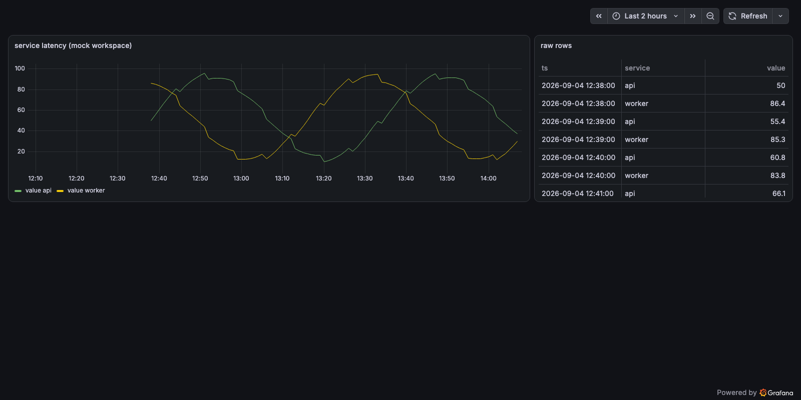

# Hotdata datasource for Grafana

Query [Hotdata](https://hotdata.dev) instant databases with SQL from Grafana dashboards, alerts, and template variables.



## Features

- **SQL editor** with autocomplete for your workspace's tables, columns, and Grafana macros
- **Table and time-series panels** — long results pivot to one series per label automatically
- **Alerting** — queries run in the plugin backend, so alert rules work out of the box
- **Template variables** — populate dashboard variables from SQL queries
- **Your dialect** — write HotSQL (native), PostgreSQL, DuckDB, or Snowflake SQL
- **Fast and type-faithful** — results stream Arrow-native from Hotdata into Grafana, so numeric precision and timestamps survive end to end

## Installation

Download the latest release zip from the [releases page](https://github.com/hotdata-dev/hotdata-grafana-datasource/releases) and extract it into your Grafana plugins directory, or install via Docker:

```bash
GF_INSTALL_PLUGINS="<release-zip-url>;hotdata-sql-datasource"
```

Until the plugin is published in the Grafana catalog, releases are unsigned — allow it explicitly:

```ini
[plugins]
allow_loading_unsigned_plugins = hotdata-sql-datasource
```

Requires Grafana 12.3 or later.

## Getting started

1. In Grafana, go to **Connections → Data sources → Add data source** and pick **Hotdata**.
2. Enter your workspace API key (`hd_…`), workspace ID, and a default database, then **Save & test**.
3. Add a panel, write SQL, and use the macros below for time-range-aware queries:

```sql
SELECT $__timeGroup(created_at, $__interval) AS time,
       status,
       count(*) AS orders
FROM shop.public.orders
WHERE $__timeFilter(created_at)
GROUP BY 1, 2
ORDER BY 1
```

| Macro | Meaning |
|---|---|
| `$__timeFilter(col)` | limit `col` to the dashboard time range |
| `$__timeFrom()` / `$__timeTo()` | the range bounds as literals |
| `$__timeGroup(col, interval)` | bucket `col` for time series |
| `$__interval` / `$__interval_ms` | the panel's interval |

Set the query format to **Time series** to get one series per label column. Full configuration and usage reference: [plugin README](src/README.md).

## Try it without an account

`docker compose up -d` starts Grafana plus a bundled mock of the Hotdata API, provisioned with a working datasource and demo dashboard — no credentials needed. Open http://localhost:3000.

## Development

```bash
npm install
npm run dev              # frontend, watch mode
mage buildAll            # backend binaries into dist/
docker compose up -d     # Grafana + mock API (see above)
```

To develop against a live workspace, export `HOTDATA_API_URL` (empty = `https://api.hotdata.dev`), `HOTDATA_API_KEY`, `HOTDATA_WORKSPACE_ID`, and `HOTDATA_DATABASE_ID` before `docker compose up`. `HOTDATA_API_URL` must be exported — if left unset it defaults to the mock.

Tests: `go test ./...` (backend) and `npm run e2e` (Playwright against the compose stack). Design notes and the wire contract live in [SPEC.md](SPEC.md).

### Releasing

Merge a PR that bumps the version in `package.json` and adds a `CHANGELOG.md` entry, then run `./scripts/tag-release.sh`. It tags `v<version>` at `origin/main`, waits for the release workflow, publishes the release, and prints the zip URL and SHA1.
