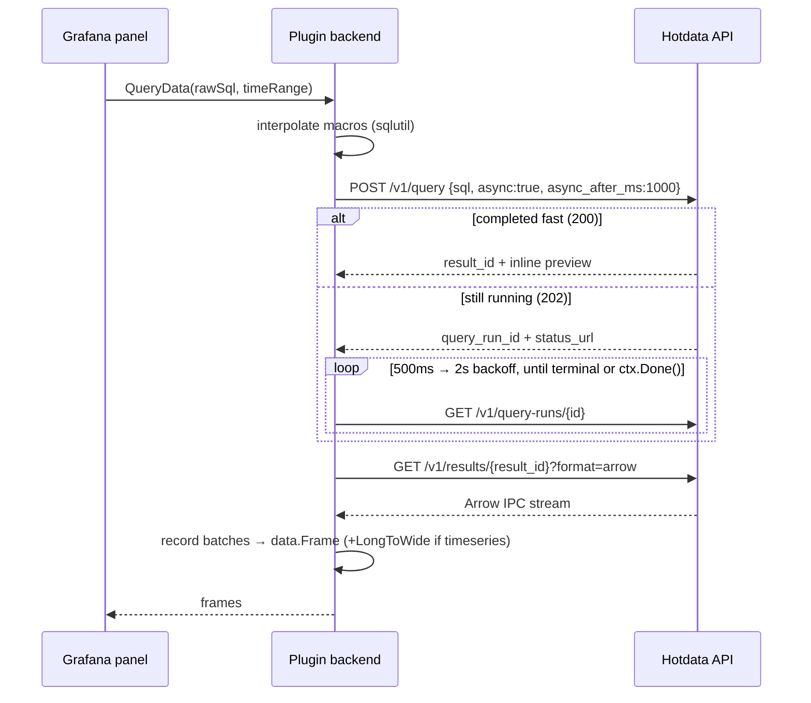

# Hotdata for Grafana — datasource plugin spec

**Plugin ID:** `hotdata-hotdata-datasource` · **Status:** M1–M3 implemented and verified; M4 pending catalog submission · **Date:** 2026-09-04
**API contract verified against** `api.hotdata.dev/v1` via CLI 0.31.0 wire captures.

## 1. Overview

A Grafana **backend datasource plugin** that runs SQL against Hotdata instant databases. Backend (Go) + frontend (React/TypeScript), scaffolded with `@grafana/create-plugin`. Being a backend plugin gives us alerting, recorded queries, and keeps the API key server-side.

**Goals:** dashboard panels, alerting, template variables, table/time-series/logs formats, schema-aware query editing.
**Non-goals (v1):** write operations, ingest management, Hotdata search/vector APIs, streaming.

## 2. Core architectural decision: Arrow end-to-end

Hotdata's engine is Arrow-native — `information_schema` reports Arrow type names (`Utf8View`, `Int64`, `Float64`) and the results endpoint serves Arrow IPC (`application/vnd.apache.arrow.stream`). Grafana data frames are also Arrow-based.

So we **skip** the `database/sql` + `sqlds` route. The inline JSON rows from `POST /v1/query` carry no type metadata (timestamps arrive as bare strings without timezone), which would force lossy type inference. Instead:

- Implement `backend.QueryDataHandler` directly.
- Always fetch results from `GET /v1/results/{id}?format=arrow` and convert record batches to frames (~200 lines; InfluxData's deprecated Flight SQL plugin is a reference implementation).
- Reuse `grafana-plugin-sdk-go/data/sqlutil` for macro interpolation only, and `data.LongToWide` for time-series shaping.

Typed, complete, no JSON round-trip.

## 3. Hotdata API contract (captured)

All requests: `Authorization: Bearer <api-key>`, `x-workspace-id: work…`. Queries add `x-database-id: dbid…`.

| Endpoint | Purpose |
|---|---|
| `POST /v1/query` | Run SQL. Body: `{"sql", "async": true, "async_after_ms", "dialect"?}` |
| `GET /v1/query-runs/{qrun}` | Poll an async run |
| `GET /v1/results/{rslt}?format=arrow` | Fetch full result as Arrow IPC stream |
| `GET /v1/databases` / `GET /v1/databases/{id}` | List databases / resolve `default_connection_id` |
| `GET /v1/information_schema?connection_id=…` | Tables; `&schema=&table=&include_columns=true` adds columns with Arrow types |
| `GET /v1/workspaces` | Workspace list (config editor) |

**Fast query → `200`** (completed within `async_after_ms`):

```json
{"query_run_id":"qrun…","result_id":"rslt…",
 "columns":["one","f","s","ts","b"],"nullable":[false,true,false,false,false],
 "rows":[[1,1.5,"x","2026-09-04T19:55:56.368620650",true]],
 "row_count":1,"preview_row_count":1,"total_row_count":1,
 "truncated":false,"execution_time_ms":2}
```

**Slow query → `202`:**

```json
{"query_run_id":"qrun…","status":"running","status_url":"/v1/query-runs/qrun…"}
```

**Poll → `200`:** `{"id","status":"running"|"succeeded"|"failed","result_id","row_count","execution_time_ms","trace_id",…}`

**Schema discovery** (`include_columns=true`):

```json
{"tables":[{"schema":"cities","table":"global","synced":true,
  "columns":[{"name":"city","data_type":"Utf8View","nullable":true},
             {"name":"latitude","data_type":"Float64","nullable":true}]}]}
```

**Operational behavior:**
- `429` with `OVERLOADED` code + `Retry-After` header under load — retry with honor, cap 3 attempts.
- Cold start: first query against an idle workspace blocks ~10–20s while the worker wakes. Not an error.
- Dialects: `hotsql` (default), `postgres`, `duckdb`, `snowflake` — non-hotsql is transpiled server-side, read-only.
- Errors carry stable codes alongside messages — branch on the code, not the sentence.

## 4. Query execution flow (backend)



Details:
- Set `async_after_ms: 1000` — the server-enforced minimum.
- Poll at 500ms, ×1.5 backoff, 2s cap. Respect `ctx.Done()` — Grafana cancels on panel abort/timeout.
- Always fetch via the Arrow results endpoint, even on the fast path — the inline JSON is an untyped preview; `truncated: true` never applies to the Arrow fetch.
- Overall deadline comes from the query context; surface cold-start waits as a frame notice ("waking workspace worker"), not an error.

## 5. Configuration

```
jsonData:        apiUrl (default https://api.hotdata.dev)
                 workspaceId
                 defaultDatabaseId
                 defaultDialect (default: postgres)
secureJsonData:  apiKey        # workspace API key (hd_…) — NOT a session JWT (5-min expiry)
```

**Health check** (`CheckHealth`): `GET /v1/databases` validates key + workspace; then `SELECT 1` against the default database with a 30s timeout — doubles as a worker warm-up. Message notes cold start if slow.

## 6. Query model

```ts
interface HotdataQuery extends DataQuery {
  rawSql: string;
  databaseId?: string;                 // falls back to datasource default
  format: 'table' | 'timeseries' | 'logs';
  dialect?: 'hotsql' | 'postgres' | 'duckdb' | 'snowflake';
}
```

**Macros** (interpolated in the backend via `sqlutil`):

| Macro | Expands to |
|---|---|
| `$__timeFilter(col)` | `col >= '…' AND col <= '…'` (RFC 3339 UTC) |
| `$__timeFrom()` / `$__timeTo()` | range bound as timestamp literal |
| `$__timeGroup(col, interval)` | time-bucket expression for GROUP BY |
| `$__interval` | panel interval string |

Dashboard variables use Grafana's standard frontend interpolation (`$var`, `${var:singlequote}`, `${var:csv}`).

## 7. Type mapping (Arrow → frame fields)

| Arrow | Frame field | Note |
|---|---|---|
| `Int8…Int64`, `UInt8…UInt64` | `*int64` | |
| `Float16/32/64` | `*float64` | |
| `Utf8`, `LargeUtf8`, `Utf8View` | `*string` | |
| `Boolean` | `*bool` | |
| `Timestamp(*, tz?)` | `*time.Time` | confirm server always emits UTC |
| `Date32/64` | `*time.Time` | |
| `Decimal128/256` | `*float64` | document precision loss |
| `Binary` | `*string` | base64 |
| `List`, `Struct`, `Map` | `*json.RawMessage` | JSON-encoded |

`format: timeseries` → `data.LongToWide` when the frame has a time column plus string dimension columns.

## 8. Frontend

- **ConfigEditor:** API URL, API key (secure input), workspace picker and default-database picker populated after key entry.
- **QueryEditor:** database select · SQL `CodeEditor` (sql language, macro + schema completion) · format select · dialect select (advanced).
- **Resource endpoints** (`CallResource`, so the key never reaches the browser; cached ~60s):
  - `GET /resources/databases`
  - `GET /resources/schemas?database=`
  - `GET /resources/tables?database=&schema=`
  - `GET /resources/columns?database=&schema=&table=`
- **Template variables:** query variables run the same path with `format: table`; first string column = value, optional second column = label.

## 9. plugin.json (sketch)

```json
{
  "type": "datasource",
  "name": "Hotdata",
  "id": "hotdata-hotdata-datasource",
  "backend": true,
  "executable": "gpx_hotdata",
  "alerting": true,
  "metrics": true,
  "annotations": true,
  "info": { "author": { "name": "Hotdata" }, "keywords": ["sql", "hotdata", "arrow", "olap"] },
  "dependencies": { "grafanaDependency": ">=10.4.0" }
}
```

## 10. Repository layout

```
hotdata-grafana/
├── src/                          # frontend
│   ├── components/ConfigEditor.tsx
│   ├── components/QueryEditor.tsx
│   ├── datasource.ts  module.ts  types.ts
│   └── plugin.json
├── pkg/
│   ├── main.go
│   └── plugin/
│       ├── datasource.go         # QueryData, CheckHealth, CallResource
│       ├── client/               # HTTP client: query, poll, results, schema
│       ├── arrow.go              # Arrow IPC → data.Frame
│       └── macros.go
├── tests/                        # @grafana/plugin-e2e (Playwright)
├── docker-compose.yaml           # local Grafana with plugin mounted
├── Magefile.go
└── package.json
```

Unit tests run the Go client against recorded fixtures (the captured payloads in §3); e2e runs against a dev workspace.

## 11. Milestones

1. **MVP** ✅ — scaffold; config editor + health check; raw SQL → sync/async flow → Arrow → table frames.
2. **Dashboards-ready** ✅ — macros (incl. `$__timeGroup`/`$__interval`), timeseries format, template variables, 429/cold-start resilience, alerting verified end-to-end (firing instances with per-series labels).
3. **UX** ✅ — SQL completion (macros/tables/columns) + database picker via resource endpoints, provisioned demo dashboard, Playwright e2e suite, bundled mock API (`pkg/cmd/mockapi`).
4. **Ship** — docs/screenshots/validator-clean package done; remaining: Grafana Cloud publishing-portal submission and signing (validator reports zero errors; target instance hotdata.grafana.net runs 13.3.0 ≥ required 12.3.0).

## 12. Open questions (server-side asks)

1. **Query cancellation** — is there a `DELETE /v1/query-runs/{id}`? Panel aborts and alert timeouts currently leak running queries.
2. **Result limits** — max size of an Arrow result fetch; is there paging on `/v1/results/{id}`?
3. **Scoped keys** — read-only API keys for dashboard use would shrink the blast radius of a leaked Grafana datasource config.
4. **Timezone guarantee** — confirm all timestamps are UTC (inline JSON emits zone-less strings like `2026-09-04T19:55:56.368620650`).
5. **Rate limits** — per-key limits matter for alert-rule fan-out (N rules × M series each interval).
6. **Keep-warm** — a way to avoid the ~20s cold start when a dashboard is the first touch of the day (ping endpoint or wake SLA).
